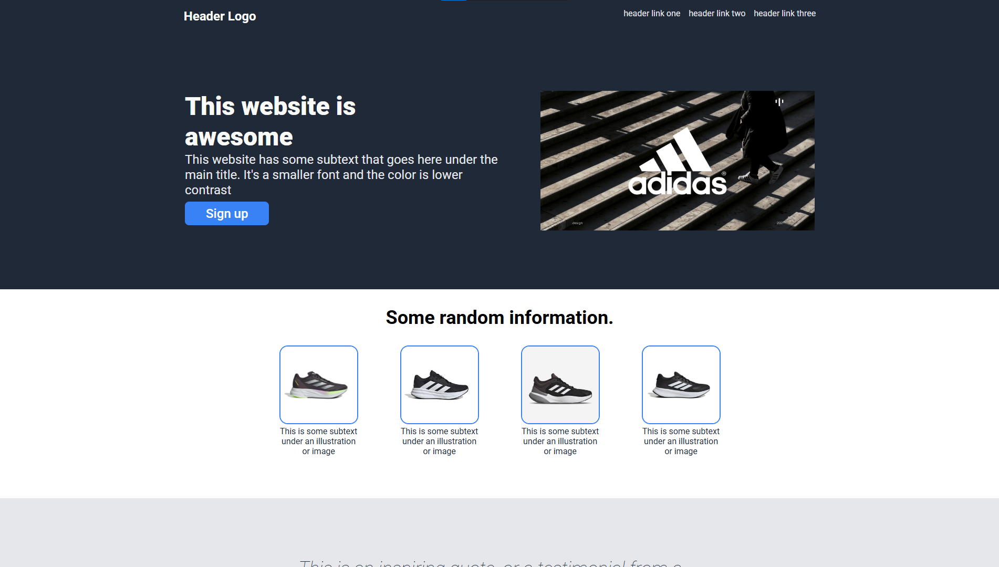
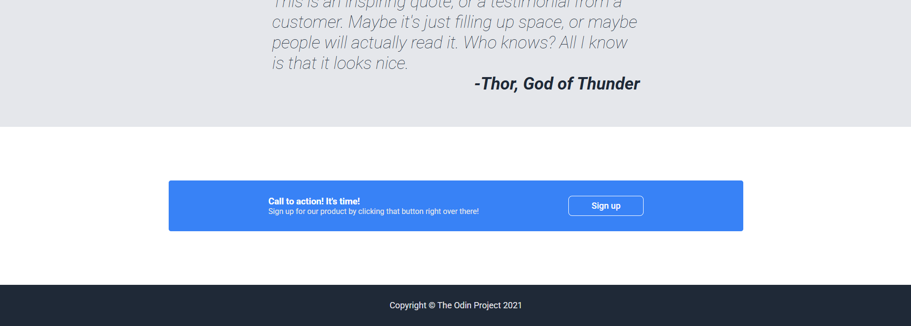

# 🌎 Lading Page - The Odin Project

> Landing Page project carried out as part of The Odin Project course

📸 Preview




## 📖 Description

This is a Landing Page designed as part of The Odin Project course. The page features a responsive and attractive design, using HTML and CSS for structure and style.

## 🛠 Used technology

- HTML5
- CSS3 (Flexbox)
- Google Fonts

## 📦 Facility

To clone this repository and view the project on your local machine:

```sh
git clone https://github.com/tu-usuario/landing-page-odin.git
cd landing-page-odin
```

Then, simply open the index.html file in your browser

## 🚀 Characteristics

✅ Responsive and modern design
✅ Use of Flexbox for flexible structure
✅ Google Fonts fonts
✅ Stylized buttons and images

## 📌 Structure of project

```bash
📂 landing-page-odin
 ┣ 📜 index.html # HTML main file
 ┣ 📜 style.css  # CSS styles file
 ┗ 📜 README.md  # Project documentation
```

## 🖌️ Personalization

You can modify the texts, colors and images in the index.html file and the styles in style.css.

## 🤝 Contributions

If you want to improve the project, fell free to fork and submit a pull request! 🚀

## 📜 License

This project is distributed under the MIT license.
